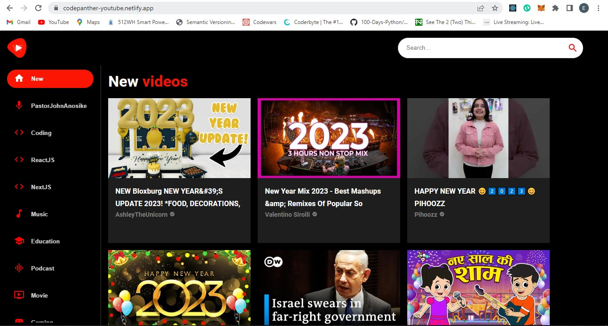
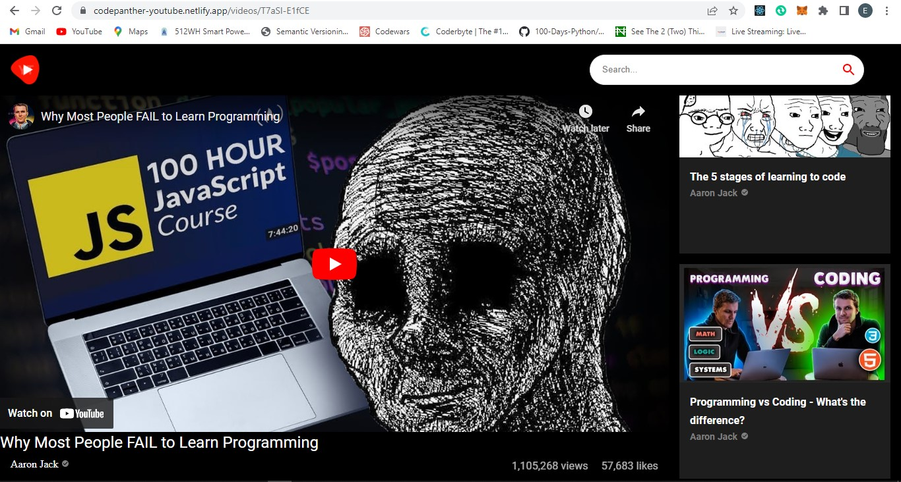
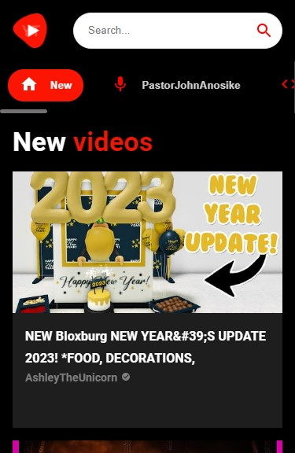

<a id="readme-top"></a>

<div align="center">
  <br/>

</div>

<!-- TABLE OF CONTENTS -->

# 📗 Table of Contents

- [📖 About the Project](#about-project)
  - [🛠 Built With](#built-with)
    - [Tech Stack](#tech-stack)
    - [Key Features](#key-features)
  - [🚀 Live Demo](#live-demo)
- [💻 Getting Started](#getting-started)
  - [Setup](#setup)
  - [Prerequisites](#prerequisites)
  - [Install](#install)
  - [Usage](#usage)
  - [Run tests](#run-tests)
  - [Deployment](#triangular_flag_on_post-deployment)
- [👥 Authors](#authors)
- [🔭 Future Features](#future-features)
- [🤝 Contributing](#contributing)
- [⭐️ Show your support](#support)
- [🙏 Acknowledgements](#acknowledgements)
- [❓ FAQ](#faq)
- [📝 License](#license)

<!-- PROJECT DESCRIPTION -->

# <h1 id="about-project">📖 YOUTUBE CLONE</h1>

> This is a youtube clone built with React.js, Material UI and an awesome API from RapidAPI.
> Users can search for channels or videos, go to a channel's page and see all their videos, play
> any video, see related videos etc.
<table>
  <th>Homepage Desktop View</th>
  <th>Video Detail Page Desktop View</th>
  <tr>
    <td></td>
    <td></td>
   </tr> 
   <th>Homepage Mobile View</th>
  <th>Video Page Mobile View</th>
   <tr>
    <td></td>
    <td>
    </td>
  </tr>
</table>

## 🛠 Built With <a id="built-with"></a>

### Tech Stack <a id="tech-stack"></a>

> The technology stack used in the development of this project is given below

<details>
  <summary>Client</summary>
  <ul>
    <li><a href="https://reactjs.org/">React.js</a></li>
    <li><a href="https://mui.com/">Material UI</a></li>
    <li><a href="https://rapidapi.com/ytdlfree/api/youtube-v31/">Youtube API from RapidAPI</a></li>
  </ul>
</details>

<!-- Features -->

### Key Features <a id="key-features"></a>

- **Search any video or channel**
- **Visit a channel's page to see all their videos**
- **Watch any video**
- **See related video suggestions**

<p align="right">(<a href="#readme-top">back to top</a>)</p>

<!-- LIVE DEMO -->

## 🚀 Live Demo <a id="live-demo"></a>

> Click the link below to see the demo

- [Live Demo Link](https://codepantha-youtube.netlify.app/)

image.png

<p align="right">(<a href="#readme-top">back to top</a>)</p>

<!-- GETTING STARTED -->

## 💻 Getting Started <a id="getting-started"></a>

> To get a local copy up and running, follow these steps.

### Prerequisites

In order to run this project you need npm which is included with Node.js.

### Setup

Clone this repository to your desired folder:

```sh
  cd my-folder
  git clone https://github.com/codepantha/youtube-clone.git
```

### Install

Install this project with:

```sh
  cd youtube-clone
  npm install
```

### Usage

To run the project, execute the following command:

```sh
  npm start
```

### Run tests

To run tests, run the following command:

```sh
  npm run test
```

### Deployment

>You can deploy this project using: [Netlify](https://app.netlify.com)

<p align="right">(<a href="#readme-top">back to top</a>)</p>

<!-- AUTHORS -->

## 👥 Authors <a id="authors"></a>

> Mention all of the collaborators of this project.

👤 **Eze Promise**

- GitHub: [@codepantha](https://github.com/codepantha)
- Twitter: [@codepantha](https://twitter.com/codepantha)
- LinkedIn: [LinkedIn](https://linkedin.com/in/promise-eze)

<p align="right">(<a href="#readme-top">back to top</a>)</p>

<!-- FUTURE FEATURES -->

## 🔭 Future Features <a id="future-features"></a>

> Features to be added to the project in the future.

- [ ] **[Coming soon]**

<p align="right">(<a href="#readme-top">back to top</a>)</p>

<!-- CONTRIBUTING -->

## 🤝 Contributing <a id="contributing"></a>

Contributions, issues, and feature requests are welcome!

Feel free to check the [issues page](https://github.com/codepantha/youtube-clone/issues).

<p align="right">(<a href="#readme-top">back to top</a>)</p>

<!-- SUPPORT -->

## ⭐️ Show your support <a id="support"></a>

If you like this project, please consider giving it a star ⭐️

<p align="right">(<a href="#readme-top">back to top</a>)</p>

<!-- ACKNOWLEDGEMENTS -->

<p align="right">(<a href="#readme-top">back to top</a>)</p>

<!-- FAQ (optional) -->

## ❓ FAQ <a id="faq"></a>

FAQs will be added here in the future

<p align="right">(<a href="#readme-top">back to top</a>)</p>

<!-- LICENSE -->

## 📝 License <a id="license"></a>

This project is [MIT](./LICENSE) licensed.

_NOTE: we recommend using the [MIT license](https://choosealicense.com/licenses/mit/) - you can set it up quickly by [using templates available on GitHub](https://docs.github.com/en/communities/setting-up-your-project-for-healthy-contributions/adding-a-license-to-a-repository). You can also use [any other license](https://choosealicense.com/licenses/) if you wish._

<p align="right">(<a href="#readme-top">back to top</a>)</p>
